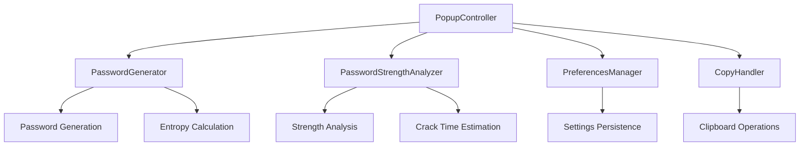

# 🔐 Secure Password Generator

<div align="center">


**A powerful, secure, and user-friendly Chrome extension for generating cryptographically strong passwords**

[](https://chrome.google.com/webstore)
[](LICENSE)
[](manifest.json)
[](https://pages.nist.gov/800-63-3/sp800-63b.html)

---

*Made with ❤️ for the Open Source community*

</div>

## 📋 Table of Contents

- [✨ Features](#-features)
- [🚀 Installation](#-installation)
- [🎯 Usage](#-usage)
- [🔧 Technical Details](#-technical-details)
- [🛡️ Security](#-security)
- [🎨 UI/UX](#-uiux)
- [📊 Password Strength Analysis](#-password-strength-analysis)
- [⚙️ Configuration Options](#️-configuration-options)
- [🏗️ Architecture](#️-architecture)
- [🤝 Contributing](#-contributing)
- [📄 License](#-license)
- [👨‍💻 About the Author](#-about-the-author)
- [📞 Contact](#-contact)

## ✨ Features

### 🔒 **Cryptographically Secure**
- Uses `crypto.getRandomValues()` for true randomness
- Implements secure random integer generation with uniform distribution
- Meets NIST SP 800-63B password requirements

### 🎛️ **Highly Customizable**
- **Password Length**: 8-64 characters
- **Character Sets**: Uppercase, lowercase, numbers, special characters
- **Smart Filtering**: Option to exclude similar characters (1, l, I, 0, O)
- **Guaranteed Inclusion**: Ensures all selected character types are present

### 📊 **Real-time Strength Analysis**
- **Entropy Calculation**: Displays password entropy in bits
- **Crack Time Estimation**: Shows estimated time to crack with modern hardware
- **Visual Strength Meter**: Color-coded strength indicator
- **Combination Count**: Total possible password combinations

### 🎨 **Modern UI/UX**
- **NeoPop Design**: Vibrant, modern interface with neon aesthetics
- **Dark Theme**: Eye-friendly dark mode
- **Responsive Design**: Optimized for Chrome extension popup
- **Smooth Animations**: Polished user interactions
- **Tooltips**: Helpful guidance for all options

### 🔧 **Developer Features**
- **Modular Architecture**: Clean, maintainable code structure
- **Preference Management**: Saves user settings via Chrome Storage API
- **Clipboard Integration**: One-click copy functionality
- **Performance Optimized**: Efficient algorithms and minimal resource usage

## 🚀 Installation

### From Chrome Web Store (Recommended)
> **Note**: Currently under review on the Chrome Web Store

1. Visit the [Chrome Web Store page](https://chrome.google.com/webstore) (coming soon)
2. Click "Add to Chrome"
3. Confirm installation
4. Access via the extension icon in your toolbar

### Manual Installation (Developer Mode)

1. **Clone the Repository**
   ```bash
   git clone https://github.com/yourusername/Secure-Password-Generator.git
   cd Secure-Password-Generator
   ```

2. **Enable Developer Mode**
   - Open Chrome and navigate to `chrome://extensions/`
   - Toggle "Developer mode" in the top right corner

3. **Load the Extension**
   - Click "Load unpacked"
   - Select the project directory
   - The extension will appear in your toolbar

## 🎯 Usage

### Basic Usage

1. **Click the Extension Icon** in your Chrome toolbar
2. **Adjust Settings** as needed:
   - Set desired password length (8-64 characters)
   - Select character types to include
   - Toggle similar character exclusion if needed
3. **Generate Password** - A secure password is automatically generated
4. **Copy to Clipboard** - Click the copy button to use your password

### Advanced Configuration

```javascript
// Example of character set options
const options = {
  length: 16,              // Password length
  uppercase: true,         // Include A-Z
  lowercase: true,         // Include a-z
  numbers: true,           // Include 0-9
  symbols: true,           // Include special characters
  excludeSimilar: false    // Exclude similar looking characters
};
```

## 🔧 Technical Details

### Core Technologies
- **Frontend**: HTML5, CSS3, Vanilla JavaScript
- **Extension**: Manifest V3
- **Security**: Web Crypto API
- **Storage**: Chrome Storage API
- **Permissions**: `storage`, `clipboardWrite`

### Browser Compatibility
- ✅ Chrome 88+
- ✅ Chromium-based browsers (Edge, Brave, Opera)
- ✅ Manifest V3 compliant

## 🛡️ Security

### Cryptographic Security
- **True Randomness**: Uses `window.crypto.getRandomValues()`
- **Uniform Distribution**: Implements bias-free random selection
- **No Predictable Patterns**: Avoids timestamp or pseudorandom seeds

### Privacy Protection
- **No Data Collection**: Passwords are never stored or transmitted
- **Local Processing**: All generation happens client-side
- **Minimal Permissions**: Only requests necessary Chrome permissions

### Security Standards Compliance
- ✅ **NIST SP 800-63B**: Digital Identity Guidelines
- ✅ **OWASP**: Password security best practices
- ✅ **Industry Standards**: Meets enterprise security requirements

## 🎨 UI/UX

### Design Philosophy
- **NeoPop Aesthetics**: Modern, vibrant design language
- **Dark Theme**: Reduces eye strain and looks professional
- **Minimalist Layout**: Clean, uncluttered interface
- **Visual Feedback**: Clear indicators for all actions

### Accessibility Features
- **High Contrast**: Excellent readability
- **Keyboard Navigation**: Full keyboard support
- **Screen Reader Compatible**: Semantic HTML structure
- **Tooltips**: Contextual help for all features

## 📊 Password Strength Analysis

### Metrics Calculated

```
Entropy = log₂(charset_size^password_length)
```

| Strength Level | Entropy Range | Description |
|---------------|---------------|-------------|
| Very Weak     | 0-30 bits     | Easily crackable |
| Weak          | 30-50 bits    | Vulnerable to attacks |
| Medium        | 50-70 bits    | Adequate for most uses |
| Strong        | 70-90 bits    | Excellent security |
| Very Strong   | 90+ bits      | Maximum security |

### Crack Time Estimation
- **Assumption**: 10 billion guesses per second (modern hardware)
- **Method**: Average case analysis (50% of search space)
- **Display**: Human-readable time units (seconds to billions of years)

## ⚙️ Configuration Options

### Password Length
- **Range**: 8-64 characters
- **Default**: 16 characters
- **Recommendation**: Minimum 12 characters for strong security

### Character Sets

| Option | Characters | Count | Security Impact |
|--------|------------|-------|----------------|
| Uppercase | A-Z | 26 | +4.7 bits per character |
| Lowercase | a-z | 26 | +4.7 bits per character |
| Numbers | 0-9 | 10 | +3.3 bits per character |
| Symbols | !@#$%^&*()_+-=[]{}|;:,.<>? | 33 | +5.0 bits per character |

### Special Options
- **Exclude Similar**: Removes confusing characters (1, l, I, 0, O)
- **Character Guarantee**: Ensures at least one character from each selected set

## 🏗️ Architecture

### File Structure
```
Secure-Password-Generator/
├── manifest.json                 # Extension configuration
├── popup.html                   # Main UI
├── css/
│   ├── styles.css               # Core styling
│   └── neopop.css              # NeoPop theme
├── js/
│   ├── password-generator.js    # Core generation logic
│   ├── password-strength-analyzer.js # Strength analysis
│   ├── preferences-manager.js   # Settings persistence
│   ├── copy-handler.js         # Clipboard operations
│   ├── neopop-integration.js   # UI theme integration
│   └── popup.js                # Main application controller
└── images/
    ├── logo.png                # Application logo
    ├── icon16.png              # Extension icon (16x16)
    ├── icon48.png              # Extension icon (48x48)
    └── icon128.png             # Extension icon (128x128)
```

### Class Architecture



### Core Classes

#### `PasswordGenerator`
- Handles secure password generation
- Implements character set management
- Ensures cryptographic randomness

#### `PasswordStrengthAnalyzer`
- Calculates password entropy
- Estimates crack time
- Provides security recommendations

#### `PreferencesManager`
- Manages user settings
- Handles Chrome Storage API
- Maintains setting persistence

## 🤝 Contributing

We welcome contributions from the community! Here's how you can help:

### Getting Started
1. **Fork** the repository
2. **Create** a feature branch: `git checkout -b feature/amazing-feature`
3. **Commit** your changes: `git commit -m 'Add amazing feature'`
4. **Push** to the branch: `git push origin feature/amazing-feature`
5. **Open** a Pull Request

### Development Guidelines
- Follow existing code style and conventions
- Add comments for complex logic
- Test all changes thoroughly
- Update documentation as needed

### Areas for Contribution
- 🌐 **Internationalization**: Multi-language support
- 🎨 **Themes**: Additional UI themes
- 🔧 **Features**: New password generation options
- 📱 **Compatibility**: Firefox/Safari extensions
- 🧪 **Testing**: Unit and integration tests

## 📄 License

This project is licensed under the MIT License - see the [LICENSE](LICENSE) file for details.

```
MIT License

Copyright (c) 2024 Harshith Vaddiparthy

Permission is hereby granted, free of charge, to any person obtaining a copy
of this software and associated documentation files (the "Software"), to deal
in the Software without restriction, including without limitation the rights
to use, copy, modify, merge, publish, distribute, sublicense, and/or sell
copies of the Software, and to permit persons to whom the Software is
furnished to do so, subject to the following conditions:

The above copyright notice and this permission notice shall be included in all
copies or substantial portions of the Software.
```

---

## 👨‍💻 About the Author

<div align="center">

### **Harshith Vaddiparthy**

*Full-Stack Developer, AI Enthusiast & Open Source Contributor*

</div>

I'm passionate about building secure, user-friendly applications that make the web a safer place. This password generator represents my contribution to the FOSS (Free and Open Source Software) community, aimed at helping users maintain better digital security practices.

### 🌟 My Work
- 🚀 Building innovative web applications and browser extensions
- 🤖 Exploring the frontiers of AI and machine learning
- 📚 Sharing knowledge through content creation and open source projects
- 🔐 Advocating for digital privacy and security

### 🎯 Mission
To democratize access to powerful, secure tools while maintaining the highest standards of privacy and user experience.

---

## 📞 Contact

<div align="center">

### 🌐 **Portfolio**
[](https://www.harshith.io/)

### 🔗 **Social Links**
[](https://x.com/harshithio)
[](https://www.linkedin.com/in/harshith-vaddiparthy/)
[](https://www.youtube.com/@harshithvaddiparthy)

### 📧 **Business Inquiries**
For custom development work, collaborations, or any questions:

**Email**: [vharshith.2810@gmail.com](mailto:vharshith.2810@gmail.com)

*I'm always excited to work on interesting projects and help bring your ideas to life!*

</div>

---

<div align="center">

### 🎉 **Special Thanks**

This project is **published and under review** on the Chrome Web Store!

**Made with ❤️ for the Open Source community**

*If you find this project helpful, please consider giving it a ⭐ on GitHub!*

---

**© 2024 Harshith Vaddiparthy. All rights reserved.**

</div> 